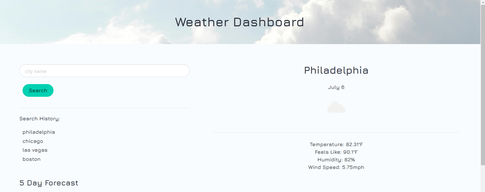
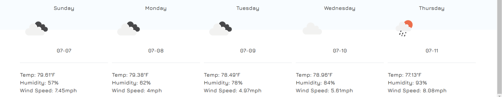

# weather-app

## Description

This weather dashboard allows users to type in a city name and see both the current forecast for that city as well as the 5 day forecast.  The current weather displays the city name, the current date, an icon representing the current weather, temperature, humidity and windspeed.

The 5 day forecast displays the day of the week along with the month and date. It also displays an icon, temperature, humidity & wind speed. 

after searching a city, the city name populates in the search history.  Users can then click on the city name to re-populate it in the input where it can be used to recall weather data for that city. 

## Installation 

website can be accessed at: https://ddurmala.github.io/weather-app/
## Usage

## Credits

coded and designed by Dana Castagna

Third-Party API: openweathermap.org

© 2024 edX Boot Camps LLC.

## License
MIT License

Copyright (c) 2024 Dana Castagna

Permission is hereby granted, free of charge, to any person obtaining a copy
of this software and associated documentation files (the "Software"), to deal
in the Software without restriction, including without limitation the rights
to use, copy, modify, merge, publish, distribute, sublicense, and/or sell
copies of the Software, and to permit persons to whom the Software is
furnished to do so, subject to the following conditions:

The above copyright notice and this permission notice shall be included in all
copies or substantial portions of the Software.

THE SOFTWARE IS PROVIDED "AS IS", WITHOUT WARRANTY OF ANY KIND, EXPRESS OR
IMPLIED, INCLUDING BUT NOT LIMITED TO THE WARRANTIES OF MERCHANTABILITY,
FITNESS FOR A PARTICULAR PURPOSE AND NONINFRINGEMENT. IN NO EVENT SHALL THE
AUTHORS OR COPYRIGHT HOLDERS BE LIABLE FOR ANY CLAIM, DAMAGES OR OTHER
LIABILITY, WHETHER IN AN ACTION OF CONTRACT, TORT OR OTHERWISE, ARISING FROM,
OUT OF OR IN CONNECTION WITH THE SOFTWARE OR THE USE OR OTHER DEALINGS IN THE
SOFTWARE.

## Features

- search for weather information by city name
- click on a city in search history to re-populate in the search input
- view current weather & 5 day Forecast
